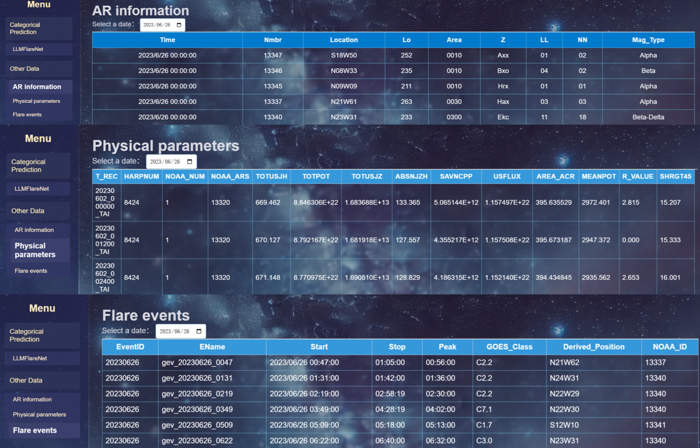
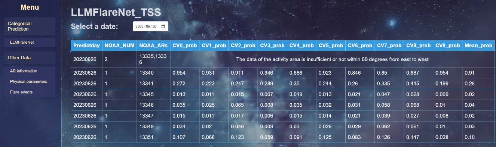

# README

<div align="center">


**LLMFlareNet：**

[](LICENSE)
[](https://www.python.org/)
[](https://pytorch.org/)

</div>

# Table of Contents

- [Overview](#overview)
- [Installation](#installation)
- [Quick Start](#quick-start)
- [Project Structure](#project-structure)
- [Training](#train-modes)
- [Evaluation](#evaluation-modes)
- [Feature Importance Analysis](#feature-importance-analysis)
- [Citation](#citation)
- [License](#license)
- [Acknowledgments](#acknowledgments)

# Overview

**LLMFlareNet** is a model that leverages **Large Language Models (LLMs)**, specifically BERT architectures, to predict M-class or above solar flare events within the next 24 hours. The system processes time-series magnetic field measurements from solar Active Regions (ARs) to perform binary classification:

- **NC (Negative Class)**: No flare or C-class flare

- **MX (Positive Class)**: M-class or X-class flare

  

We also make a solar flare forecasting system (www.justspaceweather.cn) ,





# Updates & Roadmap

### Recent Updates

- [x] Released pre-trained weights in huggingface

### Future Work
- [ ] when the paper is accteped, we will release the material soon  (training data, origin comparsion data, daily predict codes)
- [ ] Fix the inconsistency between code and paper naming
- [ ] Web API for real-time forecasting service

---

**Last Updated**: 2025-12-9

**Version**: 1.0.0


# Installation

### Prerequisites

- Python 3.8+
- CUDA 11.8+ (for GPU acceleration)

### Environment Setup

```bash
# Clone the repository
git clone https://github.com/wei-jin-fang/LLMFlareNet.git
cd LLMFlareNet

# Create conda environment
conda create -n llm_flarenet python=3.8
conda activate llm_flarenet
# Also, you can install other version
pip install -r requirements.txt
```

# Quick Start

### 1. Download Pre-trained BERT Model

The pre-trained BERT model should be placed in `pre_train_model/bert/`:

```
pre_train_model/bert/
├── config.json
├── pytorch_model.bin
├── vocab.txt
├── tokenizer.json
└── tokenizer_config.json
```

### 2.Inference

Now, we have uploaded the pre-trained weight in [huggingface](https://huggingface.co/Qduck/LLMFlareNet)

Data preparation, follow the format below
```
random_2d_list = [[random.random() for _ in range(10)] for _ in range(40)]
```
Run the  `evalation/test.py`, then you can get the output probablity

### 3. Train
Data preparation, follow the format below
```
├── data/                                  # Training data (10-fold CV splits, using for training, validating and tesing) 
│   ├── 0Train.csv, 0Val.csv, 0Test.csv    # Fold 0 data
│   ├── 1Train.csv, 1Val.csv, 1Test.csv    # Fold 1 data
│   └── ...                                # Folds 2-9
```
Run the  `train.py`, then you can get the weights and other material

# More detailed usage

We apologize for some inconsistencies between my code and the paper, specifically regarding the different naming of models. 
We will synchronize and resolve these issues as soon as possible in the future. Now, I will provide the corresponding relationships below.

```
├── Transformer.py                     # Bert——>Transformer method
├── Onefitall_16.py                    # LLMFlareNet
├── Onefitall_18.py                    # w/o BERT layer method
├── Onefitall_26.py                    # Bert(Random Parameters) method
```
## Project Structure

```
LLM_FlareNet/
├── data/                                  # Training data (10-fold CV splits, using for training, validating and tesing) 
│   ├── 0Train.csv, 0Val.csv, 0Test.csv    # Fold 0 data
│   ├── 1Train.csv, 1Val.csv, 1Test.csv    # Fold 1 data
│   └── ...                                # Folds 2-9
│
├── Data_origin/                           # Raw data before normalization
│   └── [Same structure as data/]
│
├── models/                                # Model architecture definitions
│   ├── NN.py                              # NN baseline
│   ├── LSTM.py                            # LSTM model
│   ├── Transformer.py                     # Bert——>Transformer method
│   ├── Onefitall_16.py                    # TimeLLMFlareNet
│   ├── Onefitall_18.py                    # w/o BERT layer method
│   └── Onefitall_26.py                    # Bert(Random Parameters) method
│
├── weight/                                # Trained model weights [every flod is the same structure ]
│   ├── NN/model_0.pt ... model_9.pt       # NN weights (10 folds)
│   ├── LSTM/model_0.pt ... model_9.pt     # LSTM weights (10 folds)
│   ├── Transformer/                       # Bert——>Transformer weights
│   ├── Onefitall_16/                      # TimeLLMFlareNet weights
│   ├── Onefitall_18/                      # w/o BERT layer weights
│   ├── Onefitall_26/                      # Bert(Random Parameters) weights
│   └── NN_for4.sh                         # Training script for NN model
│
├── pre_train_model/                       # Pre-trained BERT model
│   └── bert/
│       ├── config.json                    # BERT configuration
│       ├── pytorch_model.bin              # Pre-trained weights
│       ├── vocab.txt                      # Vocabulary file
│       └── tokenizer*.json                # Tokenizer configs
│
├── scripts/                               # Data processing utilities  （等待替换，只打算放四个csv链接到网页到时候给别人下载）
│   └── get_daily_data/                    # Real-time forecasting pipeline
│       ├── 0get_ARs_and_10data.py         # Download AR data from NOAA
│       ├── 1fillter_data_inference.py     # Filter & normalize data
│       ├── 2get_Event_by_today_datetime.py # Extract event data
│       ├── 3insert_label_and_new_noaaid.py # Update labels
│       ├── csv_util.py                    # CSV operations
│       ├── process_util.py                # Data processing utilities
│       ├── pymysql_util.py                # Database operations
│       ├── feishu_bot.py                  # Notification bot
│       ├── ar_flare_prediction.csv        # AR predictions (555KB)
│       ├── result_forecast.csv            # Model forecast results
│       ├── Eventdata.csv                  # Historical events (1.6MB)
│       └── sharp_data_ten_feature.csv     # SHARP magnetic features
│
├── evalation/                             # Evaluation scripts & results
│   ├── daily_mode/                        # Daily forecasting evaluation （等待替换，里面还有仅多的，最后删掉
│   │   ├── 2main.py                       # Main evaluation script
│   │   ├── split_result_csvs/             # Per-model predictions
│   │   ├── Onefitall_16_CCMC_*/           # CCMC comparison
│   │   ├── Onefitall_16_SR_*/             # Scientific Reports comparison
│   │   └── compare_data/                  # Benchmark datasets
│   │       ├── ccmc_waitcompare.csv       # CCMC reference data
│   │       └── sc_waitcompare.csv         # SR reference data
│   ├── daily_all_data_mode/               # Full dataset evaluation  （等待替换，论文没有后续删掉
│   │   └── 2main.py
│   ├── fillter_10CV/                      # Filtered 10-CV analysis
│   │   └── 1data_fillter.py
│   │   └── 2main.py                       # inference by filtered 10-CV 
│   └── model_output/                      # Aggregated results
│       └── result.xlsx                    # Consolidated metrics
│
├── feature_importance/                    # Model interpretability
│   ├── SHAP_bar_and_dot/                  # SHAP bar/dot plot results
│   │   ├── SHAP_bar_dot.py                # SHAP dot and bar plot code
│   ├── SHAP_sample/                       # Individual sample analysis
│   │   ├── SHAP_force_all_sample_combine_html.py # SHAP force Plot for every sample
│   │   └── SHAP_force_single_sample_plot.py  # SHAP force Plot for every time step
│   │   
│   └── RFE/                               # Recursive Feature Elimination
│       ├── train_RFE.py               	   # RFE trainning code
│       ├── RFE_NN_for4.sh                 # RFE trainning script for NN
│       └── weights/                       # Models with reduced features
│
├── calculation_and_draw/                  # Analysis & visualization
│   ├── calculation_NCMX_number.py         # Class distribution code
│   └── draw_daily_mode_comparsion.py      # TSS threshold plots
│  
│
│
├── train.py                               # Main training script
├── tools.py                               # Utility functions & metrics
└── README.md                              # This file
```
## Train Modes

follow the chapter [Quick Start](#quick-start).  By using the parameter details mentioned in the paper, you can obtain the weights of each model . Manually organize the result.xlsx of each model. You can get Tables 7-8 of the paper.

## Evaluation Modes

- The meanings of single, multiple, and mixed in folder names, file names, and code naming are consistent with those in the paper.
- The `Mplus` in folder names, file names, and code naming represent the forecast probability of the respective forecast system based on which forecast system the code is compared with.
- The `one` in folder names, file names, and code naming represent the forecast probability of LLMFlareNet.

### Mode 1: 10-Fold filtered CV

Run `evalation/fillter_10CV/1data_fillter.py`. Then you can get the 10-Fold filtered CV

Run `evalation/fillter_10CV/2main.py`. Then you can get the result, as shown in Tables 7–8.

### Mode 2: Daily Mode

Run `evalation/daily_mode/2main.py`. Then you can get  many result flodes.

```
 ├── Onefitall_16_CCMC_*/           # CCMC comparison
 ├── Onefitall_16_SR_*/             # Scientific Reports comparison
```

Run `calculation_and_draw/draw_daily_mode_comparsion.py`. Then you can get the plot, as shown in Figures 9-10

## Feature Importance Analysis

### RFE

Use the same model parameters as during training, modify the RFE_input_name in the code, and then run `feature_importance/RFE/train_RFE.py`. You can obtain the same output materials as the training code. Manually organize the result.xlsx of each RFE experiment. You can get Table 9 of the paper.

### SHAP_feature_important

Specify the parameter `dot `or `dot ` in the code and run `feature_importance/SHAP_bar_and_dot/SHAP_bar_dot.py `to generate the SHAP bar plot and bee swarm plot, respectively, corresponding to Figure 3 and Figure 4 in the paper.

### SHAP_sample

Run `feature_importance/SHAP_sample/SHAP_force_all_sample_combine_html.py` to generate the SHAP global force plot for all samples. Specify the active region to obtain Figure 5(a) and Figure 6(a) in the paper.

Run` feature_importance/SHAP_sample/SHAP_force_single_sample_plot.py` to generate the SHAP force plot for all time steps of all samples. Specify the active region and time step to obtain Figure 5(b) and Figure 6(b) in the paper.

# Citation

If you use LLMFlareNet in your research, please cite:

```bibtex

```

# License

This project is licensed under the **MIT License** - see the [LICENSE](LICENSE) file for details.

# Acknowledgments

- **Data Sources**:
  - SDO science teams.
  - JSOC (Joint Science Operations Center) for data access
- **Pre-trained Models**:
  - HuggingFace Transformers library for BERT implementation
- **Evaluation Benchmarks**:
  - NASA/CCMC (https://ccmc.gsfc.nasa.gov/scoreboards/flare/)
  - SolarFlareNet (https://www.nature.com/articles/s41598-023-40884-1)
- **Funding**:
  - B-type Strategic Priority Program of the Chinese Academy of Sciences (Grant No. XDB0560000)
  - National Natural Science Foundation of China (Grant No. 12473056)
  - Natural Science Foundation of Jiangsu Province (Grant No. BK20241830).

# Contact
For questions, issues, or collaborations:

- **GitHub Issues**: [https://github.com/yourusername/LLM_FlareNet/issues](https://github.com/wei-jin-fang/LLMFlareNet/issues)


---

<div align="center">


**Built with PyTorch and HuggingFace Transformers**

[Documentation](#table-of-contents) • [Installation](#installation) • [Quick Start](#quick-start) • [Citation](#citation)

</div>
